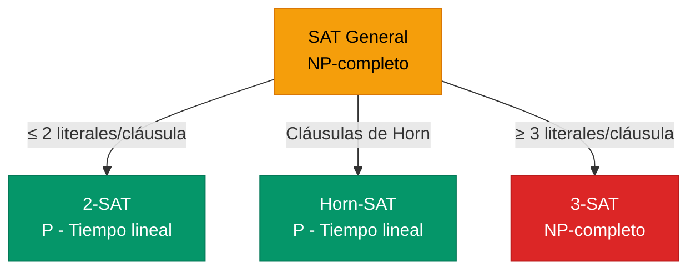

# Satisfacibilidad y SAT

El problema computacional en el corazón de la lógica.

## Introducción: Las Preguntas Fundamentales

Hasta ahora hemos aprendido a representar conocimiento (sintaxis) y a determinar cuándo es verdadero (semántica). Pero hay preguntas importantes que aún no hemos respondido:

- ¿Existe alguna situación donde mi fórmula sea verdadera?
- ¿Es mi fórmula siempre verdadera?
- ¿Mi fórmula es una contradicción?

Estas preguntas tienen nombres técnicos y están profundamente relacionadas entre sí.

---

## Clasificación de Fórmulas

Toda fórmula proposicional cae en exactamente una de tres categorías:

### Satisfacible

Una fórmula es **satisfacible** si existe **al menos un modelo** donde es verdadera.

**Ejemplo:** $P \land Q$ es satisfacible.

¿Por qué? Porque en el modelo $\{P=T, Q=T\}$, la fórmula es verdadera.

No importa que sea falsa en otros modelos (como $\{P=T, Q=F\}$). Solo necesitamos **un** modelo que la haga verdadera.

### Insatisfacible (Contradicción)

Una fórmula es **insatisfacible** si es falsa en **todos** los modelos posibles.

**Ejemplo:** $P \land \neg P$ es insatisfacible.

No importa qué valor tenga P:
- Si P=T: T ∧ F = F
- Si P=F: F ∧ T = F

No existe ningún modelo que la haga verdadera. Es una **contradicción**.

### Válida (Tautología)

Una fórmula es **válida** (o una **tautología**) si es verdadera en **todos** los modelos posibles.

**Ejemplo:** $P \lor \neg P$ es válida.

No importa qué valor tenga P:
- Si P=T: T ∨ F = T
- Si P=F: F ∨ T = T

Siempre es verdadera. Es una **ley lógica**.

### Resumen Visual


- **Satisfacibles** = Válidas + Contingentes (todo lo que no es contradicción)
- **Contingentes** = Satisfacibles pero no válidas (depende del modelo)

### Ejemplos Clasificados

| Fórmula | Satisfacible | Válida | Insatisfacible | Tipo |
|---------|:------------:|:------:|:--------------:|------|
| $P$ | ✓ | — | — | Contingente |
| $P \land Q$ | ✓ | — | — | Contingente |
| $P \lor \neg P$ | ✓ | ✓ | — | Tautología |
| $P \rightarrow P$ | ✓ | ✓ | — | Tautología |
| $(P \rightarrow Q) \lor (Q \rightarrow P)$ | ✓ | ✓ | — | Tautología |
| $P \land \neg P$ | — | — | ✓ | Contradicción |
| $(P \rightarrow Q) \land P \land \neg Q$ | — | — | ✓ | Contradicción |

#### Tablas de Verdad de los Ejemplos

**1. Contingente: $P$**

| P | Resultado |
|:---:|:---------:|
| T | **T** ✓ |
| F | **F** |

Es TRUE en 1 de 2 modelos → **Satisfacible** pero no válida → **Contingente**

---

**2. Contingente: $P \land Q$**

| P | Q | $P \land Q$ |
|:---:|:---:|:-----------:|
| T | T | **T** ✓ |
| T | F | **F** |
| F | T | **F** |
| F | F | **F** |

Es TRUE en 1 de 4 modelos → **Satisfacible** pero no válida → **Contingente**

---

**3. Tautología: $P \lor \neg P$ (Ley del Tercero Excluido)**

| P | $\neg P$ | $P \lor \neg P$ |
|:---:|:--------:|:---------------:|
| T | F | **T** ✓ |
| F | T | **T** ✓ |

Es TRUE en todos los modelos (2/2) → **Válida** → **Tautología**

**Intuición:** P es verdadero o P es falso. Siempre una de las dos opciones es cierta.

---

**4. Tautología: $P \rightarrow P$**

| P | $P \rightarrow P$ |
|:---:|:-----------------:|
| T | $T \rightarrow T = \mathbf{T}$ ✓ |
| F | $F \rightarrow F = \mathbf{T}$ ✓ |

Es TRUE en todos los modelos (2/2) → **Válida** → **Tautología**

**Intuición:** Cualquier cosa se implica a sí misma (reflexividad).

---

**5. Tautología: $(P \rightarrow Q) \lor (Q \rightarrow P)$**

| P | Q | $P \rightarrow Q$ | $Q \rightarrow P$ | $(P \rightarrow Q) \lor (Q \rightarrow P)$ |
|:---:|:---:|:-----------------:|:-----------------:|:------------------------------------------:|
| T | T | $T \rightarrow T = \mathbf{T}$ | $T \rightarrow T = \mathbf{T}$ | **T** ✓ |
| T | F | $T \rightarrow F = \mathbf{F}$ | $F \rightarrow T = \mathbf{T}$ | **T** ✓ |
| F | T | $F \rightarrow T = \mathbf{T}$ | $T \rightarrow F = \mathbf{F}$ | **T** ✓ |
| F | F | $F \rightarrow F = \mathbf{T}$ | $F \rightarrow F = \mathbf{T}$ | **T** ✓ |

Es TRUE en todos los modelos (4/4) → **Válida** → **Tautología**

**Intuición:** De dos proposiciones cualesquiera, siempre al menos una implica a la otra. ¿Por qué?
- Si tienen el mismo valor → ambas implicaciones son TRUE
- Si tienen valores diferentes → la que es FALSE implica a la que es TRUE (recordar: F→T = T)

**Clave:** Las dos implicaciones NO pueden ser FALSE simultáneamente porque:
- $P \rightarrow Q$ es FALSE solo cuando P=T y Q=F
- $Q \rightarrow P$ es FALSE solo cuando Q=T y P=F
- Es imposible tener P=T y P=F al mismo tiempo

---

**6. Contradicción: $P \land \neg P$**

| P | $\neg P$ | $P \land \neg P$ |
|:---:|:--------:|:----------------:|
| T | F | **F** ✗ |
| F | T | **F** ✗ |

Es FALSE en todos los modelos (0/2 son TRUE) → **Insatisfacible** → **Contradicción**

**Intuición:** Algo no puede ser verdadero y falso al mismo tiempo (principio de no contradicción).

---

**7. Contradicción: $(P \rightarrow Q) \land P \land \neg Q$**

| P | Q | $P \rightarrow Q$ | $\neg Q$ | $(P \rightarrow Q) \land P \land \neg Q$ |
|:---:|:---:|:-----------------:|:--------:|:----------------------------------------:|
| T | T | T | F | $T \land T \land F = \mathbf{F}$ ✗ |
| T | F | F | T | $F \land T \land T = \mathbf{F}$ ✗ |
| F | T | T | F | $T \land F \land F = \mathbf{F}$ ✗ |
| F | F | T | T | $T \land F \land T = \mathbf{F}$ ✗ |

Es FALSE en todos los modelos (0/4 son TRUE) → **Insatisfacible** → **Contradicción**

**Intuición:** Esta fórmula dice "Si P entonces Q" Y "P es verdadero" Y "Q es falso". Pero si P es verdadero y P→Q es verdadero, entonces Q debe ser verdadero (Modus Ponens). Contradicción con ¬Q.

---

## Relaciones Importantes

Estas clasificaciones están relacionadas de formas útiles:

### Relación entre Validez e Insatisfacibilidad

$$\alpha \text{ es válida} \iff \neg\alpha \text{ es insatisfacible}$$

**Intuición:** Si $\alpha$ es siempre verdadera, entonces $\neg\alpha$ es siempre falsa.

**Uso práctico:** Para verificar si $\alpha$ es una tautología, podemos verificar si $\neg\alpha$ es insatisfacible.

### Relación con Entailment

$$\alpha \models \beta \iff (\alpha \land \neg\beta) \text{ es insatisfacible}$$

**Intuición:** "$\alpha$ implica $\beta$" significa que no puede pasar que $\alpha$ sea verdadera y $\beta$ sea falsa.

**Uso práctico:** Esta es la base de la refutación por resolución que vimos en la sección anterior.

---

## El Problema SAT

El problema **SAT** (Boolean Satisfiability Problem) es:

> **Entrada:** Una fórmula proposicional $\phi$ (usualmente en CNF)
> 
> **Pregunta:** ¿Es $\phi$ satisfacible?
> 
> **Salida:** "SÍ" + un modelo que la satisface, o "NO"

### Ejemplo

**Entrada:** $(P \lor Q) \land (\neg P \lor R) \land (\neg Q \lor \neg R)$

**Proceso:** Buscar una asignación que haga todas las cláusulas verdaderas...

**Salida:** SÍ, satisfacible. Modelo: $\{P=T, Q=F, R=T\}$

**Verificación:**
- $(T \lor F) = T$ ✓
- $(F \lor T) = T$ ✓
- $(T \lor F) = T$ ✓

Todas las cláusulas son verdaderas, por lo tanto la fórmula es satisfacible.

---

## SAT es NP-Completo

### ¿Qué Significa NP-Completo?

En teoría de la complejidad, los problemas se clasifican por qué tan difíciles son de resolver:

- **P**: Problemas que se pueden **resolver** en tiempo polinomial (eficientemente)
- **NP**: Problemas cuyas soluciones se pueden **verificar** en tiempo polinomial
- **NP-completo**: Los problemas más difíciles en NP

### El Teorema de Cook-Levin (1971)

> **Teorema:** SAT es **NP-completo**.

Esto significa:
1. SAT está en NP (dada una asignación, podemos verificar en tiempo polinomial si satisface la fórmula)
2. Cualquier problema en NP se puede reducir a SAT (SAT es al menos tan difícil como cualquier otro problema en NP)

### ¿Por Qué Importa?

Si alguien encontrara un algoritmo polinomial para SAT, podría resolver **todos** los problemas en NP eficientemente. Esto implicaría P = NP.

Actualmente, la mayoría de los expertos creen que P ≠ NP, lo que significa que SAT probablemente no tiene solución polinomial.

### El Problema del Crecimiento Exponencial

El enfoque ingenuo de "probar todas las asignaciones" tiene complejidad $O(2^n)$:

| Variables | Modelos | Tiempo (1M modelos/seg) |
|:---------:|:-------:|:-----------------------:|
| 10 | ~1,000 | 0.001 segundos |
| 20 | ~1,000,000 | 1 segundo |
| 30 | ~1,000,000,000 | 17 minutos |
| 40 | ~1 billón | 12 días |
| 50 | ~10^15 | 35 años |
| 100 | ~10^30 | más que la edad del universo |

¡El crecimiento exponencial es devastador!

---

## Algoritmos para SAT

A pesar de que SAT es NP-completo (y probablemente no tiene solución polinomial en el peor caso), hay algoritmos que funcionan bien en la práctica.

### DPLL: El Algoritmo Clásico

**DPLL** (Davis-Putnam-Logemann-Loveland, 1962) mejora la búsqueda exhaustiva con tres ideas:

#### 1. Propagación de Unidad (Unit Propagation)

Si una cláusula tiene **un solo literal sin asignar**, ese literal **debe** ser verdadero para satisfacer la cláusula.

**Ejemplo:**
- Cláusulas: $(P)$, $(\neg P \lor Q)$, $(R \lor \neg Q)$
- $(P)$ es **unitaria** → asignamos $P = T$
- Simplificando: $(\neg P \lor Q)$ se convierte en $(Q)$ → también unitaria → $Q = T$
- Simplificando: $(R \lor \neg Q)$ se convierte en $(R)$ → $R = T$

Esta propagación en cascada puede resolver muchas variables sin backtracking.

#### 2. Eliminación de Literales Puros

Un literal es **puro** si solo aparece en una polaridad (siempre positivo o siempre negativo).

**Ejemplo:** Si $R$ aparece en varias cláusulas pero $\neg R$ nunca aparece, podemos asignar $R = T$ sin afectar negativamente ninguna cláusula.

#### 3. Terminación Temprana

- Si todas las cláusulas están satisfechas → **SAT**
- Si alguna cláusula está vacía (todos sus literales son falsos) → **UNSAT** en esta rama

### Pseudocódigo DPLL

```
función DPLL(cláusulas, asignación):
    # Terminación temprana
    si todas las cláusulas son verdaderas:
        retornar SAT
    si alguna cláusula es falsa:
        retornar UNSAT
    
    # Propagación de unidad
    mientras exista cláusula unitaria (l):
        asignación ← asignación ∪ {l = verdadero}
        simplificar cláusulas
    
    # Eliminación de literal puro
    mientras exista literal puro l:
        asignación ← asignación ∪ {l = verdadero}
        simplificar cláusulas
    
    # Ramificación (branching)
    elegir variable P no asignada
    si DPLL(cláusulas, asignación ∪ {P = T}) = SAT:
        retornar SAT
    retornar DPLL(cláusulas, asignación ∪ {P = F})
```

### SAT Solvers Modernos: CDCL

Los SAT solvers de hoy usan **CDCL** (Conflict-Driven Clause Learning), que extiende DPLL con:

| Técnica | Descripción |
|---------|-------------|
| **Clause Learning** | Cuando hay conflicto, analizar la causa y aprender una nueva cláusula que evite repetir el mismo error |
| **Non-chronological Backtracking** | En lugar de retroceder un nivel, saltar directamente al nivel que causó el conflicto |
| **Restarts** | Reiniciar la búsqueda periódicamente, conservando las cláusulas aprendidas |
| **Heurísticas de decisión** | Elegir inteligentemente qué variable asignar (ej: VSIDS) |

### El Éxito Práctico de SAT

Aunque SAT es NP-completo en teoría, los SAT solvers modernos resuelven instancias con **millones de variables** en segundos.


| SAT Solver | Año | Variables típicas resueltas |
|------------|:---:|:---------------------------:|
| GRASP | 1996 | ~1,000 |
| Chaff | 2001 | ~100,000 |
| MiniSat | 2003 | ~500,000 |
| CryptoMiniSat | 2009 | ~1,000,000+ |
| Kissat | 2020 | 10,000,000+ |

**¿Por qué funciona en la práctica?**

Las instancias del "mundo real" usualmente no son los peores casos. Tienen estructura que los solvers pueden explotar:
- Muchas cláusulas se simplifican rápidamente
- Las cláusulas aprendidas evitan explorar regiones inútiles
- Las heurísticas guían hacia soluciones rápidamente

---

## Casos Especiales: Cuando SAT es Fácil

No todas las restricciones sobre SAT lo mantienen difícil:

### 2-SAT: Tiempo Lineal

Si cada cláusula tiene **a lo más 2 literales**, el problema está en P.

**Ejemplo de 2-SAT:** $(P \lor Q) \land (\neg P \lor R) \land (\neg Q \lor \neg R)$

**Algoritmo:** Construir un grafo de implicaciones y buscar componentes fuertemente conexos. Complejidad: $O(n)$.

### Horn-SAT: Tiempo Lineal

Si todas las cláusulas son **cláusulas de Horn** (a lo más un literal positivo), el problema está en P.

**Algoritmo:** Forward chaining. Complejidad: $O(n)$.

### k-SAT para k ≥ 3: NP-Completo

Para cláusulas con 3 o más literales, el problema es NP-completo.

**La frontera:** 2-SAT es fácil, 3-SAT es difícil. ¡Un literal de diferencia!



---

## Aplicaciones de SAT

Los SAT solvers se usan en muchas áreas:

| Dominio | Aplicación |
|---------|------------|
| **Verificación de hardware** | Comprobar que circuitos cumplen especificaciones |
| **Verificación de software** | Model checking, encontrar bugs |
| **Planificación** | Planning as satisfiability |
| **Criptografía** | Análisis de protocolos, criptoanálisis |
| **Bioinformática** | Haplotyping, análisis de redes |
| **Scheduling** | Asignación de horarios, recursos |
| **Juegos/Puzzles** | Sudoku, N-reinas, etc. |

:::example{title="Sudoku como SAT"}

Un Sudoku 9×9 se puede codificar como SAT:

**Variables:** $x_{r,c,v}$ = "la celda (fila r, columna c) tiene el valor v"
- 9 filas × 9 columnas × 9 valores = 729 variables

**Restricciones (todas como cláusulas):**

1. **Cada celda tiene al menos un valor:**
   - Para cada (r,c): $x_{r,c,1} \lor x_{r,c,2} \lor \cdots \lor x_{r,c,9}$

2. **Cada celda tiene a lo más un valor:**
   - Para cada (r,c) y par de valores diferentes i,j: $\neg x_{r,c,i} \lor \neg x_{r,c,j}$

3. **Cada fila tiene todos los números:** 9 cláusulas por número

4. **Cada columna tiene todos los números:** 9 cláusulas por número

5. **Cada caja 3×3 tiene todos los números:** 9 cláusulas por número

6. **Valores iniciales:** Cláusulas unitarias para celdas pre-llenadas

**Resultado:** ~8,000 cláusulas. Un SAT solver resuelve cualquier Sudoku en milisegundos.

:::

---

## Ejercicios

:::exercise{title="Clasificar Fórmulas" difficulty="1"}

Clasifica cada fórmula como Válida, Satisfacible (pero no válida), o Insatisfacible:

1. $(P \rightarrow Q) \land (\neg P \rightarrow Q)$
2. $(P \rightarrow Q) \land P \land \neg Q$
3. $P \rightarrow (Q \rightarrow P)$
4. $(P \leftrightarrow Q) \land (P \leftrightarrow \neg Q)$

:::

<details>
<summary><strong>Ver Solución</strong></summary>

**1. $(P \rightarrow Q) \land (\neg P \rightarrow Q)$**

Esto dice "Si P entonces Q, Y si no-P entonces Q". En ambos casos, Q.

| P | Q | P→Q | ¬P→Q | Fórmula |
|:-:|:-:|:---:|:----:|:-------:|
| T | T | T | T | T |
| T | F | F | T | F |
| F | T | T | T | T |
| F | F | T | F | F |

Es verdadera cuando Q=T, falsa cuando Q=F. **Satisfacible** (equivalente a Q).

**2. $(P \rightarrow Q) \land P \land \neg Q$**

Esto dice "P implica Q, Y P es verdadero, Y Q es falso". ¡Contradicción!

Si P es verdadero y P→Q, entonces Q debe ser verdadero. Pero decimos Q es falso.

| P | Q | P→Q | P | ¬Q | Fórmula |
|:-:|:-:|:---:|:-:|:--:|:-------:|
| T | T | T | T | F | F |
| T | F | F | T | T | F |
| F | T | T | F | F | F |
| F | F | T | F | T | F |

**Insatisfacible**.

**3. $P \rightarrow (Q \rightarrow P)$**

Reescribiendo: $\neg P \lor (\neg Q \lor P) = \neg P \lor \neg Q \lor P$

Siempre hay $P \lor \neg P$ que es verdadero.

| P | Q | Q→P | P→(Q→P) |
|:-:|:-:|:---:|:-------:|
| T | T | T | T |
| T | F | T | T |
| F | T | F | T |
| F | F | T | T |

**Válida** (tautología).

**4. $(P \leftrightarrow Q) \land (P \leftrightarrow \neg Q)$**

Esto dice "P es equivalente a Q Y P es equivalente a no-Q". Imposible.

Si P≡Q, entonces P y Q tienen el mismo valor.
Si P≡¬Q, entonces P y Q tienen valores opuestos.
No pueden ser ambas cosas.

**Insatisfacible**.

</details>

---

:::exercise{title="DPLL Manual" difficulty="2"}

Aplica el algoritmo DPLL (a mano) a:

$$(P \lor Q) \land (\neg P \lor R) \land (\neg Q) \land (\neg R \lor S)$$

Muestra cada paso de propagación de unidad y decisiones.

:::

<details>
<summary><strong>Ver Solución</strong></summary>

**Cláusulas iniciales:**
1. $(P \lor Q)$
2. $(\neg P \lor R)$
3. $(\neg Q)$ ← **unitaria**
4. $(\neg R \lor S)$

**Paso 1: Propagación de unidad con $(\neg Q)$**
- Asignar: $Q = F$
- Simplificar cláusula (1): $(P \lor F) = (P)$ ← **nueva unitaria**
- Cláusulas restantes: $(P)$, $(\neg P \lor R)$, $(\neg R \lor S)$

**Paso 2: Propagación de unidad con $(P)$**
- Asignar: $P = T$
- Simplificar cláusula (2): $(\neg T \lor R) = (F \lor R) = (R)$ ← **nueva unitaria**
- Cláusulas restantes: $(R)$, $(\neg R \lor S)$

**Paso 3: Propagación de unidad con $(R)$**
- Asignar: $R = T$
- Simplificar cláusula (4): $(\neg T \lor S) = (F \lor S) = (S)$ ← **nueva unitaria**
- Cláusulas restantes: $(S)$

**Paso 4: Propagación de unidad con $(S)$**
- Asignar: $S = T$
- No quedan cláusulas

**Resultado:** SATISFACIBLE

**Modelo encontrado:** $\{P=T, Q=F, R=T, S=T\}$

**Verificación:**
- $(T \lor F) = T$ ✓
- $(F \lor T) = T$ ✓
- $(T)$ simplificada ✓
- $(F \lor T) = T$ ✓

**Observación:** DPLL encontró la solución usando solo propagación de unidad, sin necesidad de backtracking. ¡Muy eficiente para este caso!

</details>

---

:::exercise{title="¿P o NP-completo?" difficulty="1"}

Clasifica cada variante de SAT:

1. Cláusulas con exactamente 2 literales cada una
2. Cláusulas con exactamente 3 literales cada una
3. Todas las cláusulas son de Horn
4. Cláusulas con a lo más 47 literales cada una

:::

<details>
<summary><strong>Ver Solución</strong></summary>

1. **Exactamente 2 literales (2-SAT):**
   - **En P** — resoluble en tiempo lineal con algoritmo de componentes fuertemente conexos

2. **Exactamente 3 literales (3-SAT):**
   - **NP-completo** — es el problema de referencia para demostraciones de NP-completitud

3. **Cláusulas de Horn:**
   - **En P** — resoluble en tiempo lineal con forward chaining

4. **A lo más 47 literales:**
   - **NP-completo** — cualquier k-SAT con k ≥ 3 es NP-completo
   - 47-SAT es tan difícil como 3-SAT (de hecho, 3-SAT se puede reducir a cualquier k-SAT con k ≥ 3)

**La frontera crítica:**
- 2-SAT: P (fácil)
- 3-SAT o más: NP-completo (difícil)

</details>

---

:::exercise{title="Reducción a SAT" difficulty="3"}

Tienes 4 estudiantes (A, B, C, D) y 3 proyectos (1, 2, 3).
- Cada estudiante debe trabajar en exactamente un proyecto.
- Cada proyecto necesita al menos un estudiante.
- A y B no pueden trabajar juntos.
- C debe trabajar en el proyecto 1 o el proyecto 2.

Formula este problema como SAT. Define las variables y escribe las cláusulas.

:::

<details>
<summary><strong>Ver Solución</strong></summary>

**Variables:** $x_{E,P}$ = "estudiante E trabaja en proyecto P"
- 4 estudiantes × 3 proyectos = 12 variables
- $x_{A,1}, x_{A,2}, x_{A,3}, x_{B,1}, \ldots, x_{D,3}$

**Restricción 1: Cada estudiante en al menos un proyecto**
- $x_{A,1} \lor x_{A,2} \lor x_{A,3}$
- $x_{B,1} \lor x_{B,2} \lor x_{B,3}$
- $x_{C,1} \lor x_{C,2} \lor x_{C,3}$
- $x_{D,1} \lor x_{D,2} \lor x_{D,3}$

**Restricción 2: Cada estudiante en a lo más un proyecto**
Para cada estudiante, pares de proyectos diferentes:
- $\neg x_{A,1} \lor \neg x_{A,2}$, $\neg x_{A,1} \lor \neg x_{A,3}$, $\neg x_{A,2} \lor \neg x_{A,3}$
- (similar para B, C, D) — 12 cláusulas más

**Restricción 3: Cada proyecto tiene al menos un estudiante**
- $x_{A,1} \lor x_{B,1} \lor x_{C,1} \lor x_{D,1}$
- $x_{A,2} \lor x_{B,2} \lor x_{C,2} \lor x_{D,2}$
- $x_{A,3} \lor x_{B,3} \lor x_{C,3} \lor x_{D,3}$

**Restricción 4: A y B no juntos** (en ningún proyecto)
- $\neg x_{A,1} \lor \neg x_{B,1}$
- $\neg x_{A,2} \lor \neg x_{B,2}$
- $\neg x_{A,3} \lor \neg x_{B,3}$

**Restricción 5: C en proyecto 1 o 2**
- $x_{C,1} \lor x_{C,2}$

**Total:** 4 + 12 + 3 + 3 + 1 = 23 cláusulas

Un SAT solver encontraría una asignación válida (si existe) en milisegundos.

</details>

---

## Puntos Clave

1. **Satisfacible** = verdadera en al menos un modelo
2. **Insatisfacible** = falsa en todos los modelos (contradicción)
3. **Válida** = verdadera en todos los modelos (tautología)
4. $\alpha \models \beta \iff (\alpha \land \neg\beta)$ es insatisfacible
5. **SAT** es el problema de determinar satisfacibilidad
6. **SAT es NP-completo** — no se conoce algoritmo polinomial
7. **DPLL** mejora la búsqueda con: propagación de unidad, literales puros, terminación temprana
8. **SAT solvers modernos** (CDCL) resuelven millones de variables en la práctica
9. **2-SAT** y **Horn-SAT** están en P — casos especiales eficientes
10. SAT tiene aplicaciones en verificación, planificación, criptografía y más
