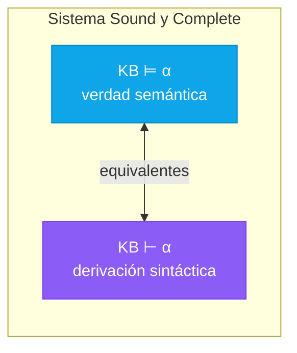
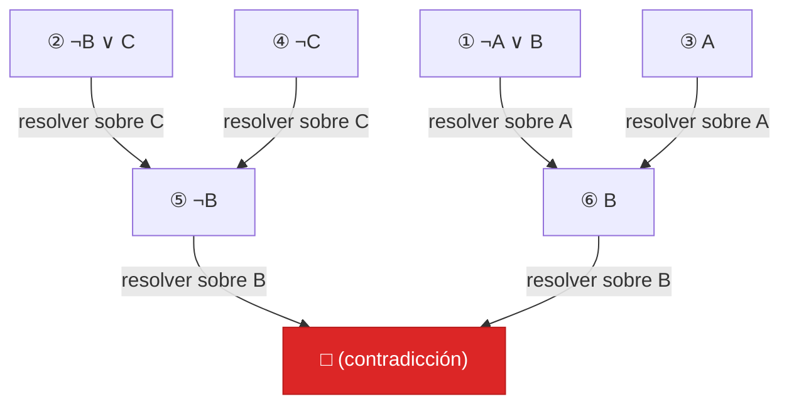
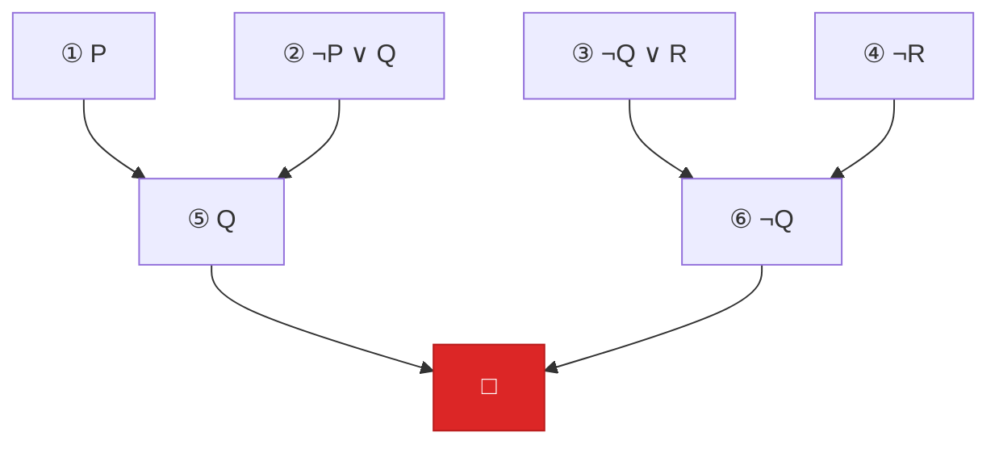

# Inferencia y Demostración

Cómo derivar nuevo conocimiento a partir de lo que ya sabemos.

## Introducción: El Objetivo de la Inferencia

En la sección anterior aprendimos a **representar** conocimiento usando lógica proposicional. Pero representar no es suficiente — necesitamos **razonar** sobre ese conocimiento para obtener nuevas conclusiones.

**El problema central:** Dada una base de conocimiento (KB) con hechos y reglas, ¿qué nuevos hechos podemos concluir?

Por ejemplo:
- **KB:** "Si llueve, la calle se moja" y "Está lloviendo"
- **Pregunta:** ¿Podemos concluir que la calle está mojada?

La respuesta es sí, y el proceso de llegar a esa conclusión se llama **inferencia**.

---

## Consecuencia Lógica (Entailment)

Antes de hablar de cómo inferir, necesitamos definir qué significa que una conclusión sea **correcta**.

### Definición Intuitiva

Decimos que $\alpha$ **implica lógicamente** a $\beta$ (escrito $\alpha \models \beta$) cuando:

> Si $\alpha$ es verdadera, entonces $\beta$ **necesariamente** también es verdadera.

Es decir, no existe ninguna situación posible donde $\alpha$ sea verdadera y $\beta$ sea falsa.

**Intuición clave:** El conocimiento más específico implica el más general.
- "Llueve Y hace frío" implica "Llueve" ✓
- "Llueve" NO implica "Llueve Y hace frío" ✗ (no necesariamente)

### Definición Formal usando Modelos

Recordemos que un **modelo** es una asignación de valores de verdad a todas las variables. Podemos definir:

$$\alpha \models \beta \quad\text{significa}\quad \text{Todo modelo que hace verdadera a } \alpha \text{ también hace verdadera a } \beta$$

Usando notación de conjuntos, si $M(\alpha)$ es el conjunto de todos los modelos donde $\alpha$ es verdadera:

$$\alpha \models \beta \iff M(\alpha) \subseteq M(\beta)$$


**Interpretación del diagrama:** El círculo azul (más pequeño) representa todos los mundos/modelos donde $\alpha$ es verdadera. El círculo verde (más grande) representa donde $\beta$ es verdadera. Si el azul está **completamente contenido dentro** del verde, entonces $\alpha \models \beta$.

**¿Por qué $M(\alpha)$ es más pequeño?** Porque $\alpha$ es más restrictiva — hay menos situaciones donde algo específico es verdadero que donde algo general lo es.

### Ejemplo Concreto con Conteo de Modelos

**Universo:** Variables P y Q → 4 modelos posibles

| Modelo | P | Q | $P \land Q$ | $P$ |
|:------:|:-:|:-:|:-----------:|:---:|
| m₁ | T | T | **T** | **T** |
| m₂ | T | F | F | **T** |
| m₃ | F | T | F | F |
| m₄ | F | F | F | F |

**Pregunta:** ¿$P \land Q \models P$? (¿"P y Q" implica "P"?)

**Análisis:**
- $M(P \land Q) = \{m_1\}$ — solo 1 modelo (más específico)
- $M(P) = \{m_1, m_2\}$ — 2 modelos (más general)
- ¿$M(P \land Q) \subseteq M(P)$? Sí, $\{m_1\} \subseteq \{m_1, m_2\}$ ✓
- **Por lo tanto:** $P \land Q \models P$ ✓

**Pregunta inversa:** ¿$P \models P \land Q$?

**Análisis:**
- $M(P) = \{m_1, m_2\}$ — 2 modelos
- $M(P \land Q) = \{m_1\}$ — 1 modelo
- ¿$M(P) \subseteq M(P \land Q)$? No, porque $m_2 \in M(P)$ pero $m_2 \notin M(P \land Q)$ ✗
- **Por lo tanto:** $P \not\models P \land Q$ ✗

**Conclusión:** El entailment es **unidireccional** — no funciona al revés.

## Tres Distinciones Fundamentales

Antes de continuar, debemos aclarar tres confusiones comunes sobre el símbolo $\models$ y conceptos relacionados.

### 1. Entailment ($\models$) vs. Implicación ($\rightarrow$)

**Esta es probablemente la confusión más frecuente en lógica.** Parecen similares pero operan en niveles completamente diferentes:

| Aspecto | **Entailment** ($\models$) | **Implicación** ($\rightarrow$) |
|---------|----------------|-----------------|
| **Naturaleza** | Relación META-lógica | Conectivo lógico |
| **Nivel** | Afirmación SOBRE fórmulas | Una fórmula dentro del lenguaje |
| **¿Qué es?** | Relación entre fórmulas | Una fórmula que puedes evaluar |
| **¿Tiene valor de verdad?** | NO (es cierto o falso como afirmación) | SÍ (TRUE/FALSE en cada modelo) |
| **Se evalúa** | Considerando TODOS los modelos | En CADA modelo individualmente |

#### Analogía

Piensa en la diferencia entre:
1. **"2 + 2 = 4"** — una afirmación matemática sobre números
2. **"4"** — un número en sí mismo

- **Entailment** es como (1): una afirmación metalógica sobre fórmulas
- **Implicación** es como (2): un objeto (fórmula) dentro del sistema lógico

#### Ejemplo Lado a Lado

Consideremos $P \land Q$ y $P$:

**Entailment:** $P \land Q \models P$
- Esta es una **afirmación metalógica** (vive "fuera" de la lógica)
- Pregunta: "¿En todos los modelos donde $P \land Q$ es TRUE, $P$ también es TRUE?"
- Se verifica examinando la relación entre conjuntos de modelos: $M(P \land Q) \subseteq M(P)$?
- Respuesta: **Cierta** ✓

**Implicación:** $(P \land Q) \rightarrow P$
- Esta es una **fórmula** (vive "dentro" de la lógica)
- Se puede evaluar en cada modelo:

| Modelo | $P$ | $Q$ | $P \land Q$ | $(P \land Q) \rightarrow P$ |
|:------:|:---:|:---:|:-----------:|:---------------------------:|
| m₁ | T | T | T | $T \rightarrow T = \mathbf{T}$ |
| m₂ | T | F | F | $F \rightarrow T = \mathbf{T}$ |
| m₃ | F | T | F | $F \rightarrow F = \mathbf{T}$ |
| m₄ | F | F | F | $F \rightarrow F = \mathbf{T}$ |

- La fórmula es TRUE en todos los modelos → es una **tautología**

#### El Teorema de Deducción: El Puente Entre Ambos

Existe una conexión profunda entre entailment e implicación:

$$\boxed{\alpha \models \beta \quad\Longleftrightarrow\quad \models (\alpha \rightarrow \beta)}$$

**En palabras:** "α implica lógicamente β" (metalenguaje) es cierto **si y solo si** "la fórmula α→β es una tautología".

**Nota sobre notación:** El símbolo $\models$ aparece de dos formas:
- $\alpha \models \beta$ — "α implica lógicamente β"
- $\models (\alpha \rightarrow \beta)$ — "la fórmula α→β es válida" (abreviación de: es TRUE en todos los modelos)

#### Pregunta Común: ¿Puede Haber Implicación Sin Entailment?

**Respuesta:** Depende de qué entendamos por "haber implicación":

**Caso 1:** ¿Puede la fórmula α→β ser TRUE en algunos modelos aunque α⊭β?
- **SÍ.** La fórmula puede ser verdadera en ciertos modelos sin ser tautología.

**Caso 2:** ¿Puede α→β ser tautología sin que α⊨β?
- **NO.** Por el Teorema de Deducción, son equivalentes.

**Ejemplo ilustrativo:** $P \not\models Q$ (no hay entailment)

Evaluemos la fórmula $P \rightarrow Q$:

| Modelo | $P$ | $Q$ | $P \rightarrow Q$ |
|:------:|:---:|:---:|:-----------------:|
| m₁ | T | T | $T \rightarrow T = \mathbf{T}$ ✓ |
| m₂ | T | F | $T \rightarrow F = \mathbf{F}$ ❌ |
| m₃ | F | T | $F \rightarrow T = \mathbf{T}$ ✓ |
| m₄ | F | F | $F \rightarrow F = \mathbf{T}$ ✓ |

- ✗ NO hay entailment: $P \not\models Q$ (en m₂, P es TRUE pero Q es FALSE)
- ✓ La fórmula $P \rightarrow Q$ **sí puede ser TRUE** (lo es en m₁, m₃, m₄)
- ✗ PERO $P \rightarrow Q$ **NO es tautología** (es FALSE en m₂)

**Conclusión:** La fórmula de implicación puede existir y ser verdadera en algunos modelos, pero el entailment solo ocurre cuando es verdadera en **todos** los modelos.

---

### 2. Entailment ($\models$) vs. Equivalencia ($\equiv$)

El entailment es **unidireccional**. La equivalencia requiere ambas direcciones:

| Concepto | Notación | Significado | Bidireccional |
|----------|----------|-------------|---------------|
| **Entailment** | $\alpha \models \beta$ | Si α es TRUE, entonces β debe ser TRUE | ❌ NO |
| **Equivalencia** | $\alpha \equiv \beta$ | α y β son TRUE en exactamente los mismos modelos | ✅ SÍ |

**Definición formal:**
$$\alpha \equiv \beta \quad\Longleftrightarrow\quad M(\alpha) = M(\beta) \quad\Longleftrightarrow\quad (\alpha \models \beta) \land (\beta \models \alpha)$$

#### Conexión con el Bicondicional

Similar al Teorema de Deducción, existe un teorema para equivalencia:

$$\boxed{\alpha \equiv \beta \quad\Longleftrightarrow\quad \models (\alpha \leftrightarrow \beta)}$$

**En palabras:** Dos fórmulas son equivalentes si y solo si su bicondicional es una tautología.

#### Ejemplos Comparativos

| Caso | Entailment | Equivalencia | Explicación |
|------|------------|--------------|-------------|
| $P \land Q$ vs. $P$ | $P \land Q \models P$ ✓ | $P \land Q \not\equiv P$ ✗ | Unidireccional: conjunción implica cada conjunto, pero no al revés |
| $P \land Q$ vs. $Q \land P$ | Ambos $\models$ al otro ✓ | $P \land Q \equiv Q \land P$ ✓ | Equivalentes: mismo conjunto de modelos |
| $P \lor Q$ vs. $\neg(\neg P \land \neg Q)$ | Ambos $\models$ al otro ✓ | $P \lor Q \equiv \neg(\neg P \land \neg Q)$ ✓ | Ley de De Morgan |

**Resumen:**
- $(P \land Q) \rightarrow P$ es **tautología** (entailment existe)
- $(P \land Q) \leftrightarrow P$ **NO es tautología** (no son equivalentes)
- $(P \land Q) \leftrightarrow (Q \land P)$ **es tautología** (son equivalentes)

---

### 3. Entailment ($\models$) vs. Inferencia/Derivación ($\vdash$)

Finalmente, debemos distinguir entre **verdad semántica** y **derivación sintáctica**:

| Concepto | Símbolo | Naturaleza | Pregunta que responde |
|----------|:-------:|------------|----------------------|
| **Entailment** | $\models$ | Semántica (verdad en modelos) | ¿Es $\beta$ verdadera siempre que $\alpha$ lo es? |
| **Derivación** | $\vdash$ | Sintáctica (manipulación simbólica) | ¿Puedo derivar $\beta$ aplicando reglas a $\alpha$? |

**Diferencia clave:**
- **Entailment** es una **relación sobre la verdad** — existe independientemente de nosotros, basada en la semántica de los modelos.
- **Derivación** es un **proceso computacional** — aplicamos reglas mecánicamente, manipulando símbolos.

**Ejemplo:**
- $P, P \rightarrow Q \models Q$ — afirma que en todos los modelos donde P y P→Q son TRUE, Q también lo es
- $P, P \rightarrow Q \vdash Q$ — afirma que podemos derivar Q aplicando Modus Ponens

#### ¿Cuándo Coinciden? Propiedades de un Sistema de Inferencia

Un sistema de inferencia es **bueno** cuando la derivación sintáctica ($\vdash$) coincide con la verdad semántica ($\models$). Esto requiere dos propiedades fundamentales:

**1. Soundness (Correctitud):** Si puedes derivarlo, es verdad.

$$\text{Si } \alpha \vdash \beta \text{, entonces } \alpha \models \beta$$

Un sistema **sound** nunca produce conclusiones falsas. Es **confiable** — todo lo que deriva es semánticamente válido.

**2. Completeness (Completitud):** Si es verdad, puedes derivarlo.

$$\text{Si } \alpha \models \beta \text{, entonces } \alpha \vdash \beta$$

Un sistema **complete** puede encontrar todas las verdades. Es **potente** — no se "pierde" ninguna consecuencia lógica válida.

**El ideal:** Un sistema que sea **sound Y complete**.

$$\alpha \vdash \beta \quad\Longleftrightarrow\quad \alpha \models \beta$$

Cuando ambas propiedades se cumplen, la derivación sintáctica y la verdad semántica son **equivalentes**.

**Buenas noticias:** Para lógica proposicional, existen sistemas de inferencia que son sound Y complete (por ejemplo, resolución, tableaux semánticos, deducción natural).



---

## Reglas de Inferencia

Las **reglas de inferencia** son patrones de razonamiento que garantizan preservar la verdad. Si las premisas son verdaderas, la conclusión también lo es.

La notación estándar es:

$$\frac{\text{premisa}_1, \quad \text{premisa}_2, \quad \ldots}{\text{conclusión}}$$

La línea horizontal se lee "por lo tanto".

### Modus Ponens: La Regla Fundamental

**Modus Ponens** (del latín "modo de afirmar") es la regla de inferencia más importante:

$$\frac{P \rightarrow Q, \quad P}{Q}$$

**En palabras:** Si sabemos que "P implica Q" y sabemos que "P es verdadero", podemos concluir que "Q es verdadero".

:::example{title="Modus Ponens en Acción"}

**Conocimiento:**
1. "Si llueve, la calle se moja" → $Llueve \rightarrow CalleMojada$
2. "Está lloviendo" → $Llueve$

**Aplicando Modus Ponens:**

$$\frac{Llueve \rightarrow CalleMojada, \quad Llueve}{CalleMojada}$$

**Conclusión:** La calle está mojada.

Esto coincide con nuestra intuición. Modus Ponens formaliza el razonamiento "obvio".

:::

### Modus Tollens: Razonando hacia Atrás

**Modus Tollens** (del latín "modo de negar") trabaja en dirección opuesta:

$$\frac{P \rightarrow Q, \quad \neg Q}{\neg P}$$

**En palabras:** Si "P implica Q" y "Q es falso", entonces "P debe ser falso".

**Intuición:** Si la consecuencia no ocurrió, la causa tampoco pudo ocurrir.

:::example{title="Modus Tollens en Acción"}

**Conocimiento:**
1. "Si llueve, la calle se moja" → $Llueve \rightarrow CalleMojada$
2. "La calle NO está mojada" → $\neg CalleMojada$

**Aplicando Modus Tollens:**

$$\frac{Llueve \rightarrow CalleMojada, \quad \neg CalleMojada}{\neg Llueve}$$

**Conclusión:** No está lloviendo.

Esto es equivalente a usar la contrapositiva: "Si la calle no está mojada, entonces no llovió."

:::

### Otras Reglas de Inferencia Útiles

**Eliminación de AND (Simplificación):**
$$\frac{P \land Q}{P} \qquad \frac{P \land Q}{Q}$$

Si sabes que "P y Q", puedes concluir P (o Q) por separado.

**Introducción de AND (Conjunción):**
$$\frac{P, \quad Q}{P \land Q}$$

Si sabes P y sabes Q independientemente, puedes concluir "P y Q".

**Introducción de OR (Adición):**
$$\frac{P}{P \lor Q}$$

Si sabes P, puedes concluir "P o Q" (para cualquier Q). Esto parece raro, pero es válido porque el OR es inclusivo.

**Silogismo Hipotético (Transitividad):**
$$\frac{P \rightarrow Q, \quad Q \rightarrow R}{P \rightarrow R}$$

Si P implica Q, y Q implica R, entonces P implica R. Las implicaciones se "encadenan".

**Silogismo Disyuntivo:**
$$\frac{P \lor Q, \quad \neg P}{Q}$$

Si "P o Q", y "no P", entonces debe ser Q.

---

## Método 1: Verificación por Enumeración de Modelos

El método más directo para verificar si $KB \models \alpha$ es comprobar **todos** los modelos posibles.

### Algoritmo

```
Para verificar KB ⊨ α:
1. Generar todos los modelos posibles (2^n para n variables)
2. Para cada modelo m:
   - Si KB es verdadera en m:
     - Verificar que α también sea verdadera en m
     - Si α es falsa, entonces KB ⊭ α (contraejemplo encontrado)
3. Si todos los modelos donde KB es verdadera también hacen α verdadera:
   - Entonces KB ⊨ α
```

### Implementación en Python

```python
def entails_by_enumeration(kb, alpha, symbols, model):
    """
    Verifica si KB ⊨ alpha probando todos los modelos.
    
    - kb: la base de conocimiento (fórmula)
    - alpha: lo que queremos verificar
    - symbols: lista de variables proposicionales
    - model: asignación parcial actual
    """
    if not symbols:  # No quedan variables por asignar
        # Modelo completo - verificar
        if evaluate(kb, model):  # Si KB es verdadera en este modelo...
            return evaluate(alpha, model)  # ...alpha también debe serlo
        else:
            return True  # KB falsa → no es un contraejemplo
    else:
        # Tomar la siguiente variable
        p = symbols[0]
        rest = symbols[1:]
        # Probar ambos valores
        return (entails_by_enumeration(kb, alpha, rest, {**model, p: True}) and
                entails_by_enumeration(kb, alpha, rest, {**model, p: False}))
```

### Complejidad

- **Tiempo:** $O(2^n)$ donde n = número de variables
- **Espacio:** $O(n)$ para la recursión

**Problema:** El tiempo es exponencial. Para 20 variables hay más de un millón de modelos. Para 100 variables, hay más modelos que átomos en el universo.

Necesitamos métodos más inteligentes.

---

## Método 2: Resolución

La **resolución** es una regla de inferencia poderosa que, junto con una estrategia de refutación, forma un sistema de inferencia completo.

### La Regla de Resolución

La resolución combina dos cláusulas que contienen literales **complementarios** (uno positivo y otro negativo de la misma variable):

$$\frac{(A \lor B \lor C), \quad (\neg B \lor D \lor E)}{(A \lor C \lor D \lor E)}$$

**En palabras:** Si tenemos $B$ en una cláusula y $\neg B$ en otra, podemos "cancelarlos" y combinar el resto.

### ¿Por Qué Funciona?

Pensemos en $(P \lor Q)$ y $(\neg P \lor R)$:

- Caso 1: P es verdadero → Por $(\neg P \lor R)$, R debe ser verdadero
- Caso 2: P es falso → Por $(P \lor Q)$, Q debe ser verdadero

En ambos casos, $Q \lor R$ es verdadero. La variable P "desaparece" porque consideramos ambos casos.

### Ejemplo de Resolución

**Cláusulas:**
1. $P \lor Q$
2. $\neg P \lor R$

**Resolución sobre P:**

$$\frac{P \lor Q, \quad \neg P \lor R}{Q \lor R}$$

Los literales $P$ y $\neg P$ se cancelan, quedando $Q \lor R$.

---

## Refutación por Resolución

La resolución por sí sola no es suficiente para probar cosas — necesitamos una **estrategia**. La más común es la **refutación**.

### La Idea de la Refutación

Para probar que $KB \models \alpha$, usamos una **demostración por contradicción**:

1. **Asumimos** que $\alpha$ es falsa (añadimos $\neg\alpha$ a la KB)
2. **Intentamos** derivar una contradicción
3. Si llegamos a una contradicción, nuestra suposición era incorrecta, por lo tanto $\alpha$ debe ser verdadera

**Fundamento matemático:**
$$KB \models \alpha \iff (KB \land \neg\alpha) \text{ es insatisfacible}$$

Si no hay ningún modelo donde KB sea verdadera y α sea falsa, entonces KB implica α.

### La Cláusula Vacía

En resolución, una **contradicción** se representa con la **cláusula vacía** (denotada $\square$ o $\{\}$).

¿Cuándo surge? Cuando resolvemos dos cláusulas unitarias complementarias:

$$\frac{P, \quad \neg P}{\square}$$

La cláusula vacía significa "FALSE" — una contradicción.

### Ejemplo Completo de Refutación

**Problema:** Demostrar que $\{A \rightarrow B,\; B \rightarrow C,\; A\} \models C$

**Paso 1: Convertir a CNF**
- $A \rightarrow B$ → $\neg A \lor B$
- $B \rightarrow C$ → $\neg B \lor C$
- $A$ → $A$

**Paso 2: Añadir la negación del objetivo**
- $\neg C$

**Cláusulas iniciales:**
1. $\neg A \lor B$
2. $\neg B \lor C$
3. $A$
4. $\neg C$

**Paso 3: Aplicar resolución hasta encontrar $\square$**

- Resolver (2) y (4) sobre C: $\neg B$ (cláusula 5)
- Resolver (1) y (3) sobre A: $B$ (cláusula 6)  
- Resolver (5) y (6) sobre B: $\square$ ✓



**Conclusión:** Derivamos $\square$, lo que significa que $KB \land \neg C$ es insatisfacible. Por lo tanto, $KB \models C$.

### Teorema de Completitud

**Teorema:** El algoritmo de resolución es **sound** y **complete** para lógica proposicional.

- **Sound:** Si derivamos $\square$, entonces realmente hay una contradicción.
- **Complete:** Si hay una contradicción, la resolución eventualmente encontrará $\square$.

---

## Método 3: Forward y Backward Chaining

Para bases de conocimiento con **cláusulas de Horn** (a lo más un literal positivo por cláusula), existen algoritmos mucho más eficientes.

### Forward Chaining (Encadenamiento Hacia Adelante)

**Idea:** Empezar con los hechos conocidos y "propagar" hacia adelante aplicando reglas hasta llegar al objetivo (o agotar posibilidades).

**Proceso:**
1. Comenzar con los hechos conocidos en una "agenda"
2. Para cada hecho en la agenda:
   - Marcarlo como procesado
   - Ver qué reglas tienen este hecho como premisa
   - Si todas las premisas de una regla están satisfechas, añadir su conclusión a la agenda
3. Repetir hasta encontrar el objetivo o vaciar la agenda


:::example{title="Forward Chaining Paso a Paso"}

**Base de conocimiento:**
- Hechos: $A$, $B$
- Reglas: 
  - $R_1$: $A \land B \rightarrow C$
  - $R_2$: $C \rightarrow D$

**Objetivo:** ¿Es $D$ verdadero?

**Ejecución:**

| Paso | Agenda | Acción | Nuevos hechos |
|:----:|--------|--------|---------------|
| 1 | [A, B] | Procesar A: actualizar contadores | — |
| 2 | [B] | Procesar B: R₁ tiene todas sus premisas | C |
| 3 | [C] | Procesar C: R₂ tiene su premisa | D |
| 4 | [D] | **¡Encontrado!** | — |

**Resultado:** Sí, $D$ es derivable.

:::

### Backward Chaining (Encadenamiento Hacia Atrás)

**Idea:** Empezar con el objetivo y trabajar hacia atrás, preguntando "¿qué necesito para probar esto?"

**Proceso:**
1. Comenzar con el objetivo como "meta"
2. Si la meta es un hecho conocido, éxito
3. Si no, buscar reglas cuya conclusión sea la meta
4. Recursivamente probar las premisas de esas reglas
5. Si todas las premisas se pueden probar, la meta se puede probar


:::example{title="Backward Chaining Paso a Paso"}

**Misma KB:** Hechos: $A$, $B$; Reglas: $R_1$, $R_2$

**Objetivo:** ¿Es $D$ verdadero?

**Ejecución:**

1. **Meta: D** — ¿Es D un hecho? No. ¿Hay reglas que concluyan D? Sí: R₂ dice $C \rightarrow D$
2. **Nueva meta: C** — ¿Es C un hecho? No. ¿Hay reglas? Sí: R₁ dice $A \land B \rightarrow C$
3. **Nuevas metas: A, B**
   - ¿Es A un hecho? **Sí** ✓
   - ¿Es B un hecho? **Sí** ✓
4. Volviendo: A y B probados → C probado → D probado ✓

:::

### Comparación de Estrategias

| Aspecto | Forward Chaining | Backward Chaining |
|---------|------------------|-------------------|
| **Dirección** | Datos → Objetivo | Objetivo → Datos |
| **Empieza con** | Hechos conocidos | La pregunta/objetivo |
| **Ventaja** | Útil para derivar todo lo posible | Solo deriva lo necesario |
| **Desventaja** | Puede derivar cosas irrelevantes | Puede repetir trabajo |
| **Uso típico** | Monitoreo, alertas | Responder consultas |
| **Analogía** | "¿Qué puedo concluir de esto?" | "¿Cómo pruebo esto?" |

**Complejidad:** Ambos son $O(n)$ para cláusulas de Horn, donde n es el tamaño de la KB. ¡Mucho mejor que $O(2^n)$!

---

## Ejercicios

:::exercise{title="Aplicar Reglas de Inferencia" difficulty="1"}

Dada la base de conocimiento:
1. $Estudia \rightarrow Aprueba$
2. $Aprueba \rightarrow Feliz$  
3. $\neg Feliz$

Usando Modus Ponens y/o Modus Tollens, ¿qué puedes derivar?

Muestra cada paso de derivación.

:::

<details>
<summary><strong>Ver Solución</strong></summary>

**Derivación:**

**Paso 1:** Aplicar Modus Tollens a (2) y (3)

$$\frac{Aprueba \rightarrow Feliz, \quad \neg Feliz}{\neg Aprueba}$$

Derivamos: $\neg Aprueba$

**Paso 2:** Aplicar Modus Tollens a (1) y $\neg Aprueba$

$$\frac{Estudia \rightarrow Aprueba, \quad \neg Aprueba}{\neg Estudia}$$

Derivamos: $\neg Estudia$

**Conclusiones derivadas:**
- $\neg Aprueba$ (no aprobó)
- $\neg Estudia$ (no estudió)

**Interpretación:** Sabemos que no está feliz. Razonando hacia atrás: si no está feliz, no aprobó; si no aprobó, no estudió.

</details>

---

:::exercise{title="Refutación por Resolución" difficulty="2"}

Usa refutación por resolución para demostrar:

$$\{P,\; \neg P \lor Q,\; \neg Q \lor R\} \models R$$

Muestra todas las cláusulas y cada paso de resolución.

:::

<details>
<summary><strong>Ver Solución</strong></summary>

**Paso 1: Preparar las cláusulas**

La KB ya está en CNF:
1. $P$
2. $\neg P \lor Q$
3. $\neg Q \lor R$

Añadir negación del objetivo:
4. $\neg R$

**Paso 2: Aplicar resolución**

- **Resolución de (1) y (2) sobre P:**
  $$\frac{P, \quad \neg P \lor Q}{Q}$$
  Nueva cláusula (5): $Q$

- **Resolución de (3) y (4) sobre R:**
  $$\frac{\neg Q \lor R, \quad \neg R}{\neg Q}$$
  Nueva cláusula (6): $\neg Q$

- **Resolución de (5) y (6) sobre Q:**
  $$\frac{Q, \quad \neg Q}{\square}$$
  Derivamos la cláusula vacía.

**Conclusión:** $\square$ derivada → $KB \models R$ ✓



</details>

---

:::exercise{title="Trazar Forward Chaining" difficulty="2"}

Ejecuta forward chaining para:

**Hechos:** $A$, $B$

**Reglas:**
- $R_1$: $A \land B \rightarrow C$
- $R_2$: $C \rightarrow D$
- $R_3$: $A \land D \rightarrow E$
- $R_4$: $B \land E \rightarrow F$

¿Qué hechos se derivan? Muestra el estado de la agenda en cada paso.

:::

<details>
<summary><strong>Ver Solución</strong></summary>

**Estado inicial:**
- Hechos inferidos: ∅
- Agenda: [A, B]
- Contadores de premisas: R₁=2, R₂=1, R₃=2, R₄=2

**Paso 1: Procesar A**
- Marcar A como inferido
- A aparece en R₁ y R₃
- R₁: contador 2→1
- R₃: contador 2→1
- Agenda: [B]

**Paso 2: Procesar B**
- Marcar B como inferido
- B aparece en R₁ y R₄
- R₁: contador 1→0 → **disparar**: añadir C
- R₄: contador 2→1
- Agenda: [C]

**Paso 3: Procesar C**
- Marcar C como inferido
- C aparece en R₂
- R₂: contador 1→0 → **disparar**: añadir D
- Agenda: [D]

**Paso 4: Procesar D**
- Marcar D como inferido
- D aparece en R₃
- R₃: contador 1→0 → **disparar**: añadir E
- Agenda: [E]

**Paso 5: Procesar E**
- Marcar E como inferido
- E aparece en R₄
- R₄: contador 1→0 → **disparar**: añadir F
- Agenda: [F]

**Paso 6: Procesar F**
- Marcar F como inferido
- F no aparece en ninguna regla
- Agenda: []

**Resultado final:** Se derivaron: A, B, C, D, E, F (todos los hechos)

</details>

---

:::exercise{title="Comparar Forward y Backward" difficulty="2"}

Para la KB del ejercicio anterior, si solo quieres saber si $E$ es verdadero:

1. ¿Forward chaining deriva hechos innecesarios?
2. ¿Qué haría backward chaining?

:::

<details>
<summary><strong>Ver Solución</strong></summary>

**1. Forward chaining:**

Forward chaining deriva A, B, C, D, E, **F**. 

El hecho F es **innecesario** para responder si E es verdadero. Forward chaining lo deriva porque sigue todas las reglas que puede disparar.

**2. Backward chaining para E:**

- **Meta: E** — ¿Hay regla? Sí: R₃ ($A \land D \rightarrow E$)
- **Metas: A, D**
  - **A:** ¿Es hecho? Sí ✓
  - **D:** ¿Es hecho? No. ¿Hay regla? Sí: R₂ ($C \rightarrow D$)
    - **Meta: C** — ¿Hay regla? Sí: R₁ ($A \land B \rightarrow C$)
      - **Metas: A, B** — Ambos son hechos ✓
    - C probado ✓
  - D probado ✓
- E probado ✓

**Backward chaining NO examina R₄ ni deriva F**, porque F no es necesario para probar E.

**Conclusión:** Para consultas específicas, backward chaining es más eficiente porque solo explora lo relevante.

</details>

---

## Puntos Clave

1. **Entailment** ($\alpha \models \beta$): β es verdadero en todo modelo donde α es verdadero
2. **Soundness**: El sistema nunca deriva falsedades
3. **Completeness**: El sistema puede derivar todas las verdades
4. **Modus Ponens**: De $P \rightarrow Q$ y $P$, concluir $Q$
5. **Modus Tollens**: De $P \rightarrow Q$ y $\neg Q$, concluir $\neg P$
6. **Resolución**: Combinar cláusulas cancelando literales complementarios
7. **Refutación**: Para probar $KB \models \alpha$, mostrar que $KB \land \neg\alpha$ es insatisfacible (derivar $\square$)
8. **Forward chaining**: Datos → Objetivo (deriva todo lo posible)
9. **Backward chaining**: Objetivo → Datos (deriva solo lo necesario)
10. Para **cláusulas de Horn**, forward/backward chaining son $O(n)$ — muy eficientes
