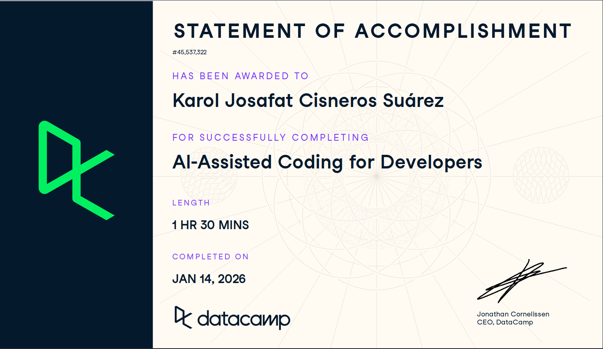

# Plantilla de Entrega

Esta es la plantilla que debes copiar a tu carpeta `estudiantes/tu_usuario/certificaciones/` para entregar la evidencia del curso.

**Curso:** [AI Assisted Coding for Developers](https://app.datacamp.com/learn/courses/ai-assisted-coding-for-developers)

**Requisitos de la evidencia:**
1. El nombre del curso
2. El progreso al 100%
3. Tu usuario logueado

---

# Evidencia: AI Assisted Coding for Developers

Nombre del Estudiante: [Tu Nombre Aquí]
Fecha: [Fecha]

## Prueba de Finalización

```markdown

```

o enlace al certificado público:
[Pegar Link Aquí]
